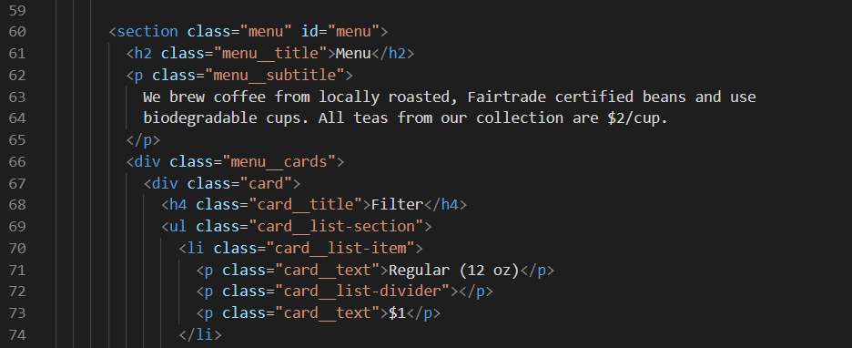
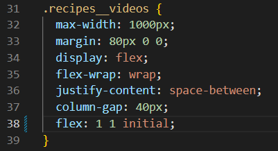
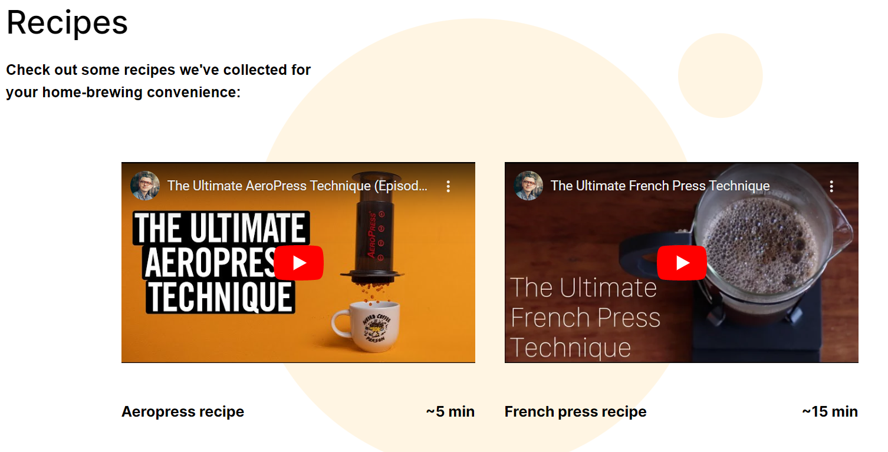
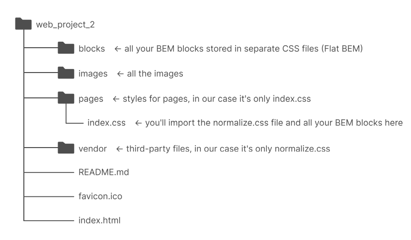
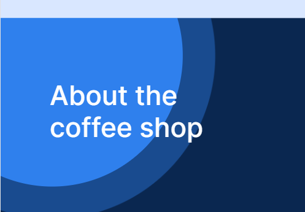

# Practicum Coffee Shop

This is the second project of the Web Development program at Practicum. It was created using HTML and CSS, based on the design brief.

## Project features

- Semantic HTML5
  Great code formatting using VSCode for easy reading:
  

- Flexbox
  Flex propertie allow for changes in display size:
  

- Positioning
  Elements are nested and positioned to be aesthetically pleasing:
  

- Flat BEM
  Folders are set up using Flat BEM for easy navigation:
  

- A custom form
  A custom form for booking a table:
  

- CSS animation and transform
  Animation to show the heartbeat of the coffee shop:
  

## Plan on improving the project

- Make changes suggested by a code editor will be implemented after project submission.
- Custom recipe videos.
- Descriptions of each menu item.
